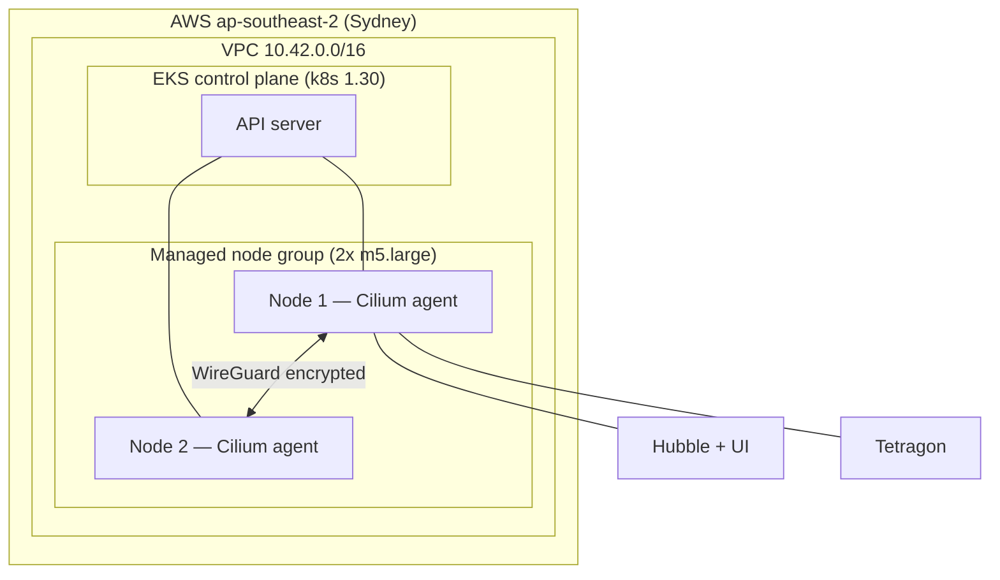
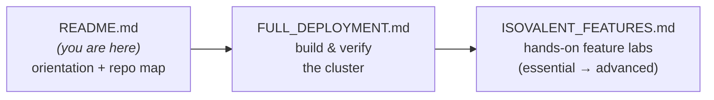

# CiliumOSS-EKS

Provision an **Amazon EKS** cluster in **AWS Sydney (`ap-southeast-2`)** and run the
**free / open-source Isovalent stack** — **Cilium** (as a full replacement for the AWS
VPC CNI) plus **Tetragon** for runtime security — entirely with **Terraform**.

> No Isovalent Enterprise license required. This installs the upstream `cilium/cilium`
> and `cilium/tetragon` Helm charts, the OSS foundation of the Isovalent platform.

---

## What you get

| Area | Detail |
|------|--------|
| Region | `ap-southeast-2` (Sydney) |
| Control plane | Amazon EKS, Kubernetes `1.30` |
| Compute | Managed node group, 2 × `m5.large` |
| CNI | **Cilium in ENI mode**, replacing `aws-node` (AWS VPC CNI) |
| Service routing | **kube-proxy replacement** (no `kube-proxy`) |
| Encryption | **WireGuard** node-to-node |
| Observability | **Hubble** + **Hubble UI** |
| Runtime security | **Tetragon** + a sample `TracingPolicy` |
| Multi-cluster | **ClusterMesh** API server (ready to pair) |
| Lab apps | Google Online Boutique, Cilium Star Wars L7 demo |

## Architecture



## Repository layout

```
.
├── README.md                     # this intro
├── FULL_DEPLOYMENT.md            # complete, keystroke-level end-to-end guide
├── .gitignore
├── terraform/                    # all infrastructure as code
│   ├── versions.tf               # provider/version pins
│   ├── variables.tf              # tunables (region, sizes, versions)
│   ├── terraform.tfvars          # default values (no secrets)
│   ├── providers.tf              # aws / kubernetes / helm providers
│   ├── vpc.tf                    # VPC, subnets, NAT gateway
│   ├── eks.tf                    # EKS cluster + managed node group
│   ├── cilium.tf                 # bootstrap (strip VPC CNI) + Cilium Helm release
│   ├── tetragon.tf               # Tetragon Helm release
│   └── outputs.tf                # cluster name/endpoint/kubeconfig command
├── cilium/
│   └── values.yaml.tftpl         # templated Cilium Helm values
└── lab/
    ├── deploy.sh                 # deploys all lab workloads
    ├── starwars-l7-policy.yaml   # L7 CiliumNetworkPolicy
    └── tetragon-tracingpolicy.yaml
```

## Learning path — start here

New to EKS, Kubernetes, or Cilium? Work through the three documents in order. Together they
form a self-contained course that takes you from a blank laptop to confidently operating an
observable, encrypted, policy-secured cluster.



| Step | Document | What you'll do | Start at |
|------|----------|----------------|----------|
| **1** | **[FULL_DEPLOYMENT.md](FULL_DEPLOYMENT.md)** | Learn the core concepts, then build the cluster keystroke-by-keystroke and verify the Cilium/Hubble/Tetragon stack is healthy. | [Section 0 — Concepts you need first](FULL_DEPLOYMENT.md#0-concepts-you-need-first) |
| **2** | **[ISOVALENT_FEATURES.md](ISOVALENT_FEATURES.md)** | Exercise every feature — Hubble observability, L3/L4/L7 & DNS policy, WireGuard, Tetragon enforcement, ClusterMesh and more. | [Section 0 — Core concepts](ISOVALENT_FEATURES.md#0-core-concepts-the-mental-model) |
| **3** | **[FULL_DEPLOYMENT.md › Teardown](FULL_DEPLOYMENT.md#11-teardown)** | Destroy the lab to stop billing (it rebuilds in ~20 min whenever you want it back). | — |

> **In a hurry and already know the stack?** Skip to [Quick start](#quick-start) below.
> Otherwise, begin with **Step 1** — every later step assumes the vocabulary it teaches.

## Quick start

```bash
cd terraform
terraform init
terraform apply
aws eks update-kubeconfig --region ap-southeast-2 --name isovalent-syd
../lab/deploy.sh
```

> **New here, or want every command, gotcha and verification step?**
> Read **[FULL_DEPLOYMENT.md](FULL_DEPLOYMENT.md)** — a complete, manual, copy-paste
> walkthrough from an empty laptop to a working, observable, encrypted cluster,
> including every error we hit in the real world and how to fix it.
>
> **Want to actually use the platform?**
> See **[ISOVALENT_FEATURES.md](ISOVALENT_FEATURES.md)** — hands-on labs from essential to
> advanced: Hubble observability, L3/L4/L7 & DNS policy, WireGuard, Tetragon enforcement,
> egress gateway, ClusterMesh, Gateway API, mutual auth, and more.

## Cost & cleanup

This creates billable resources (EKS control plane, 2 EC2 nodes, NAT gateway, 2 load
balancers). Tear everything down with:

```bash
cd terraform
terraform destroy
```

## Security

- **Never commit AWS keys.** Credentials live in `~/.aws/credentials` (created by
  `aws configure`), which is outside this repo and ignored by Git.
- Terraform state can contain sensitive values — `*.tfstate*` is git-ignored. Use a
  remote backend (e.g. S3 + DynamoDB) for real/shared environments.
- Rotate any access key the moment it is exposed.

## License

OSS components are under their respective upstream licenses (Cilium & Tetragon: Apache-2.0).
